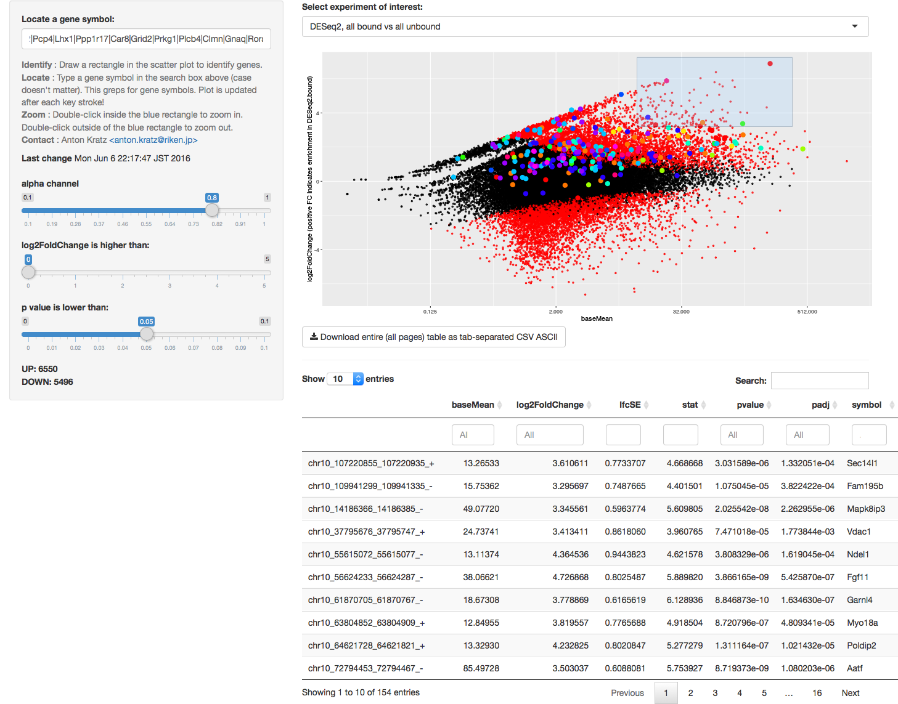

# DEIVA (Shiny version): Interactive Visual Analysis of DESeq2 differential gene expression test results 

## Interactive exploration of gene expression tests made easy
DEIVA (Differential Gene Expression Interactive Visual Analysis) is a web app to identify and locate genes in scatter plots of DESeq2 results. 

The aim was to create a web app that meets user expectations and can be used without any knowledge of R, spreadsheets, or programming.

Using DEIVA, domain experts can examine the results of a differential gene expression test and immediately get answers to questions such as "What is the expression level of my genes of interest?", "How does expression of these genes differ between the two different states?", and can easily retrieve lists of genes just by brushing (highlighting) them.

While this could also be achieved using any spreadsheet program like Excel, LO Calc or Google Sheets, that process would be slow, cumbersome, and not intuitive.

DEIVA provides an interface where domain experts simply go to a URL and can immediately search for genes, retrieve genes, and filter results lists.

DEIVA is written in R using Shiny, DT and ggplot2.

## DEIVA meets user expectations
The interface is self-explanatory and should be usable by anyone accustomed to a contemporary web app. 

Deploying a DEIVA web app however requires basic knowledge of R (which can be taken for granted because the content provider already has used R to work with DESeq2 in the first place), and a basic understanding of installing the Shiny server.

## Expanding DEIVA
The code provided here works out of the box with the example given. But DEIVA can easily be expanded and modified to your own project. In particular the input data file can be augmented by more columns encoding gene features of interest, and these features can be rendered in different styles in the plot. 

## Features
* **Select** an experiment from a drop-down list of DESeq2 results.
* **Identify** genes by brushing (by drawing a rectangle).
* **Locate** genes by searching for their name. **Multiple genes can be located at the same time** (separated by the pipe symbol "|"), and are **automatically highlighted in different colors** (two different color schemes are available).
* **Search** for genes in the data table.
* **Export** genes from the data table with the "Download" button as a comma-separated ASCII file, which can be loaded into any spreadsheet application.
* **Zoom** into the scatterplot by first drawing a rectangle, than double-click on it. Zoom out by double-clicking anywhere else.
* **Filter** two different cut-off sliders which are linked by logical "and". Number of genes passing the filter, up and down, is shown.
* **Mobile device support**. The user interface adapts to desktop as well as mobile environment devices.

## Preparing input data files
You need at least one input data file, which is a slightly augmented output from DESeq2.

The input file needs to have the following columns:

* Feature (not in header!)
* symbol
* baseMean
* log2FoldChange
* lfcSE
* stat
* pvalue
* padj

The header does NOT contain an entry for the first column! In a typical DESeq2 analysis, the first column will not be exported with a header field anyway.

DESeq2 does not have a standard output file format. Write the result of a differential expression test to a file with TAB as the separator and no hyphens to delineate fields.

The DESeq2 output is augmented by one column: symbol. This contains a gene symbol associated with the feature (cluster, transcription initiation site) of interest. This column is searched for when locating genes. The feature column can not be used for this, because there is no one-to-one relationship between features and genes.

Example for a DEIVA input file:

|feature	|symbol	|baseMean	|log2FoldChange		|lfcSE		|stat		|pvalue		|padj|
|---	|---	|---		|---			|---		|---		|---		|--- |
|chr2\_246405441\_246405521\_+	| Grid|1.64173845899039|0.899050240043084|4.76263324936837|0.188771671671825|0.850271775363256|0.925548049366256|
|chr12\_54086426\_54086466\_+	| Pcp2|5.30160933550825|1.61745325417192|4.82390235826869|0.335299749879769|0.737398982387807|0.864181693747462|
|chr7\_36876604\_36876766\_+	| n/a|1.18273903072599|-6.06413567391466|3.87533117153996|1.564804504567|0.117628755226941|0.585133009869474|

### Where to put the files

Put the input file(s) into the subdirectoy tsv


## Things not working or not working as expected ##

### Locating genes
This search box will immediately grep for the string which is in it, and highlight those genes in green which are hit by the grep. This means that if the search box is empty, all genes will be highlighted.

To do: replace this search box with selectizeInput and server-side search, or program a better text parsing and search.

## Installation
Install: R, shiny, shiny-server. Don't forget to enable user directories, and make sure the server is accessible (ports are open etc).

Install the needed libraries into R (DT, ggplot2, shiny).

Put the data files into the appropriate location on the server (have a look at ui.R to find out the location).

Put server.R and ui.R into a directory ~/ShinyApps/deseq2.

Tested with R version 3.2.2 (2015-08-14) -- "Fire Safety", Platform: x86_64-pc-linux-gnu (64-bit).

## Super easy quick deployment with runGitHub!
In R/RStudio run these two lines, it will download and start DEIVA:
```library(shiny)
runGitHub("antonkratz/deiva_github", "anton.kratz@gmail.com")
```

